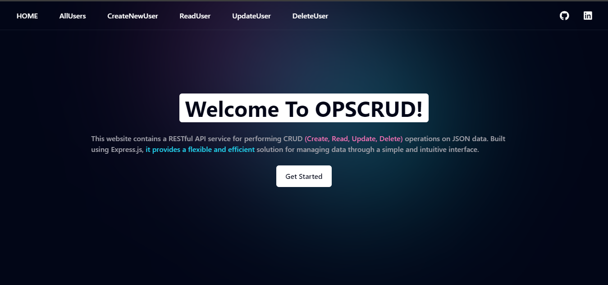

# api-crud-ops

#### This repository contains a RESTful API service for performing CRUD (Create, Read, Update, Delete) operations on data. Built using Express.js, it provides a flexible and efficient solution for managing data through a simple and intuitive interface.


## HOME PAGE PREVIEW
 


## Dependencies

[](https://expressjs.com/)

[](https://ejs.co/)

[](https://www.npmjs.com/package/nodemon)

[](https://www.npmjs.com/package/express-rate-limit)


## Installation

1. Clone this repository to your local machine.

```bash
git clone https://github.com/Emmraan/api-crud-ops.git
```

2. Navigate to the project directory.

```bash
cd  api-crud-ops
```
3. Install dependencies using npm:

```bash
npm install
```

## Usage

### To start the development server, run the following command:

```
npm run dev
```
### Server Auto-Restart with Nodemon 🔄
### Accessing the Server On 🌐 http://localhost:3000